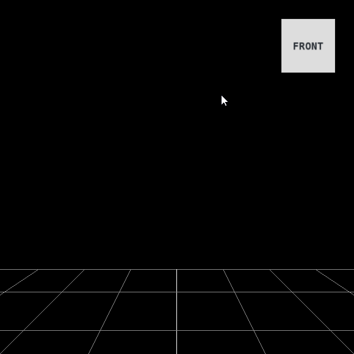

# ViewCubeControls - camera viewpoint controls (WIP)

This is a simple [ThreeJS](http://threjs.org) module, which provides experience similar to the ViewCube used in Autodesk products.  
This allows you easily change the camera view angles by clicking on the faces of the view cube. [Demo](https://codesandbox.io/s/y35w749501).

## License
MIT

